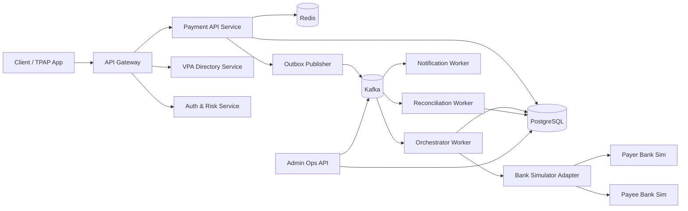
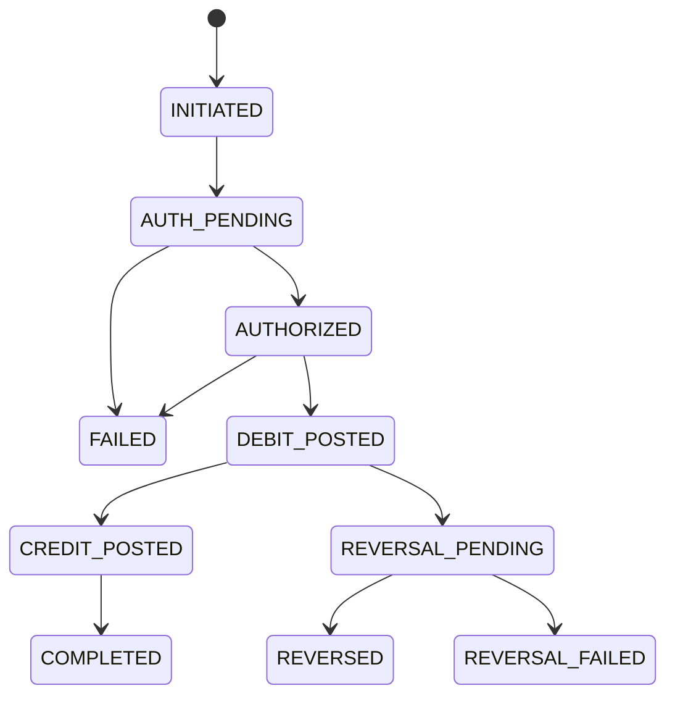
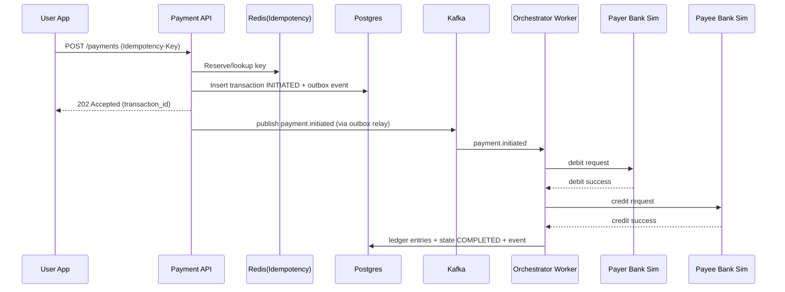

# UPI-Inspired Payment Rail Simulator — System Architecture (Backend-First)

## 1. Purpose

This document defines a **production-grade simulator architecture** for an instant payment rail inspired by UPI principles:

- double-entry accounting
- strict transaction state machine
- idempotent APIs and workers
- deterministic reversal/refund logic
- reconciliation and auditable operations

> This is a **simulator/sandbox architecture** for learning and engineering rigor, not an official NPCI implementation and not for real-money operations.

---

## 2. Goals and non-goals

## 2.1 Goals

1. Correctness over convenience: no money creation/loss.
2. Deterministic behavior under retries, duplicates, and partial failures.
3. Traceability: every state change and ledger movement is auditable.
4. Operational realism: async jobs, reconciliation, disputes, risk checks.
5. Scalable core that can process high concurrency safely.

## 2.2 Non-goals

1. Integration with live banking/NPCI systems.
2. Regulatory production claims.
3. Real card-network processing.

---

## 3. High-level architecture



---

## 4. Core bounded contexts

## 4.1 Payments context

- Receives payment requests.
- Applies idempotency and request validation.
- Creates transaction aggregate.
- Emits domain events through transactional outbox.

## 4.2 Ledger context

- Maintains append-only double-entry records.
- Enforces debit-credit balance invariants.
- Supports immutable audit and replay.

## 4.3 Orchestration context

- Drives transaction state transitions.
- Coordinates payer debit and payee credit legs.
- Handles timeout, retry, and compensation triggers.

## 4.4 Reconciliation context

- Compares transactional truth sources (ledger vs settlement logs).
- Detects discrepancies and creates actionable incidents.

## 4.5 Risk & controls context

- Velocity limits.
- amount and behavior anomaly policies.
- participant/account throttling and hold actions.

---

## 5. Transaction lifecycle model



### Transition rules

1. No skipped transition without explicit reason code.
2. Every transition creates an immutable `transaction_events` record.
3. Any terminal state (`COMPLETED`, `FAILED`, `REVERSED`, `REVERSAL_FAILED`) is final.

---

## 6. Critical sequence flows

## 6.1 Happy path: pay request



## 6.2 Failure after debit: automatic reversal

1. Debit succeeds, credit fails/timeouts beyond threshold.
2. Worker marks `REVERSAL_PENDING`.
3. Creates compensating reversal transaction linked to original.
4. Posts reversal ledger entries and finalizes as `REVERSED`.

---

## 7. Data architecture

## 7.1 Storage choices

- **SQLite (modernc.org/sqlite)**: source of truth, ACID state + ledger + events. Pure Go driver with no CGO dependencies.
- **In-process idempotency cache**: request hash + scope-key unique constraint for duplicate detection.
- **Outbox pattern**: `outbox_events` table for reliable async event propagation (phase 2 integration with Kafka/NATS).

## 7.2 Core schema (logical)

- `accounts`
- `vpas`
- `transactions`
- `transaction_events`
- `ledger_entries` (append-only)
- `idempotency_records`
- `reversals`
- `reconciliation_runs`
- `reconciliation_diffs`
- `outbox_events`

## 7.3 Hard invariants

1. For each settled transaction, sum(debits) == sum(credits).
2. No ledger row updates/deletes after insert.
3. One idempotency key maps to one canonical response per scope.
4. Transaction version increments monotonically for optimistic control.

---

## 8. API architecture

## 8.1 Public APIs (simulator)

1. `POST /api/v1/payments`
2. `GET /api/v1/payments/{transaction_id}`
3. `POST /api/v1/payments/{transaction_id}/confirm`
4. `POST /api/v1/payments/{transaction_id}/cancel`
5. `POST /api/v1/reversals`
6. `GET /api/v1/accounts/{account_id}/ledger`
7. `POST /api/v1/reconciliation/run`

## 8.2 API behavior contracts

- Idempotency key required on mutation endpoints.
- Correlation ID propagated end-to-end.
- Consistent error envelope with machine-readable codes.
- Pagination and cursoring for ledger/event queries.

---

## 9. Reliability patterns

## 9.1 Idempotency strategy

- Request-level dedupe in Redis + persisted idempotency table.
- Worker-level dedupe using event id + consumer group offsets.

## 9.2 Transactional outbox

- Write domain changes and outbox record in the same DB transaction.
- Background relay publishes outbox events to Kafka.
- Guarantees no “DB committed but event lost” scenario.

## 9.3 Saga-style orchestration

- Payment orchestration is a saga:
  - step 1: authorize + debit
  - step 2: credit
  - compensation: reversal if step 2 cannot complete

## 9.4 Retry policy

- Exponential backoff with jitter.
- Retry only for retriable error classes.
- Dead-letter queue for poison events.

---

## 10. Security architecture

## 10.1 Baseline controls

1. TLS everywhere.
2. Service-to-service auth (signed service tokens/mTLS).
3. At-rest encryption for sensitive fields.
4. Secret management (no credentials in repo).

## 10.2 Data protection

- Minimize PII in events.
- Hash/tokenize sensitive account references in logs.
- Role-based admin operations with audit logging.

## 10.3 Abuse/fraud controls

- Per-account and per-device rate limits.
- Velocity policies at API and orchestration layers.
- Rule-based risk score gates (allow/hold/reject).

---

## 11. Observability and operations

## 11.1 Metrics

- API latency/error rates by endpoint.
- transaction state transition counters.
- ledger posting latency.
- reversal rates and causes.
- reconciliation mismatch counts.

## 11.2 Logging and tracing

- Structured JSON logs with `transaction_id`, `correlation_id`, `idempotency_key`.
- Distributed tracing from API -> worker -> bank simulator adapter.

## 11.3 Alerts

- Stuck transactions in non-terminal states beyond SLA.
- outbox backlog threshold breach.
- mismatch spikes in reconciliation.
- abnormal reversal ratio.

---

## 12. Deployment architecture

```mermaid
flowchart TB
    subgraph Runtime
      A1[Go API Server]
      A2[Worker Pool (goroutines)]
      A3[Outbox Relay Worker]
      A4[Reconciliation Service]
    end

    B1[(SQLite DB)]
    C1[Observability Stack]

    A1 --> B1
    A2 --> B1
    A3 --> B1
    A4 --> B1
    A1 --> C1
    A2 --> C1
```

### Environment strategy

1. **Development**: Single binary + SQLite (embedded, file-based).
2. **Staging**: Binary with production-like load, ledger invariant validation.
3. **Production readiness**: Event bus integration (Kafka/NATS), distributed tracing, metrics collection.

### Deployment model

- **MVP (Phase 1-2)**: Single Go binary + SQLite, chi HTTP router, goroutine-based async.
- **Scale (Phase 3+)**: Horizontal API server replication, event bus for worker distribution, external SQLite replication (WAL mode).

---

## 13. Offline/Bluetooth extension (bounded-risk mode)

## 13.1 Design principle

Offline proximity payments are modeled as **deferred-finality** transactions:

- intent exchange offline (BLE/NFC)
- temporary local acceptance under strict limits
- final settlement only after online sync

## 13.2 Controls required

1. Low per-txn and per-wallet caps.
2. Expiring signed offline tokens.
3. Device-bound keys and monotonic counters.
4. Double-spend detection on sync with deterministic conflict policy.

---

## 14. Capacity and performance engineering

## 14.1 Performance targets (simulator)

- p95 API latency under normal load: < 150 ms for initiate endpoint.
- asynchronous completion target: < 2 s for happy path.
- zero invariant violations across concurrent stress tests.

## 14.2 Scaling strategy

- Stateless API horizontal scaling.
- Partition Kafka topics by transaction/account key.
- DB connection pooling and write path optimization.
- Read replicas for analytics/admin queries.

---

## 15. Failure scenarios and handling

1. **Duplicate API request** -> return same canonical response via idempotency record.
2. **Worker crash mid-flow** -> replay from Kafka; state transition guards prevent corruption.
3. **Credit leg timeout after debit** -> enter `REVERSAL_PENDING`, execute compensation.
4. **Outbox relay failure** -> retry relay; no data loss due to persisted outbox rows.
5. **Reconciliation mismatch** -> open incident and mark transaction for operational review.

---

## 16. Build phases (implementation order)

1. **Foundation**: project skeleton, DB migrations, core entities, API bootstrap.
2. **Payment core**: idempotent create flow + transaction state machine.
3. **Ledger engine**: append-only debit/credit posting + invariants.
4. **Async orchestration**: Kafka + workers + outbox.
5. **Reversal/retry**: compensation paths and failure policies.
6. **Reconciliation**: run, diff, and incident workflow.
7. **Risk controls**: velocity and policy gates.
8. **Ops hardening**: metrics, tracing, dashboards, alerting, load tests.

---

## 17. Architecture decisions (ADR summary)

1. **PostgreSQL as financial source of truth** for ACID guarantees.
2. **Append-only ledger** to preserve audit integrity.
3. **Transactional outbox** to guarantee event consistency.
4. **Saga orchestration** for multi-step payment execution.
5. **Idempotency mandatory** on all mutating APIs.

---

## 18. Definition of done for architecture quality

Architecture is acceptable when:

1. All money-movement invariants are codified and testable.
2. Every state transition is explicit and auditable.
3. Duplicate/retry behavior is deterministic.
4. Failure compensation paths are complete and automated.
5. Operational visibility exists for each critical stage.

---

## 19. Quick repository mapping (target)

```text
src/
  api/
    routes/
    schemas/
  domain/
    payments/
    ledger/
    reconciliation/
    risk/
  infra/
    db/
    cache/
    messaging/
  workers/
  services/
  adapters/
tests/
  unit/
  integration/
  load/
docs/
  architecture.md
```

---

## 20. Final note

This architecture intentionally prioritizes **financial correctness, deterministic recovery, and auditability**.  
If trade-offs are needed, optimize in this order:

1. correctness
2. traceability
3. resilience
4. latency
5. feature velocity

